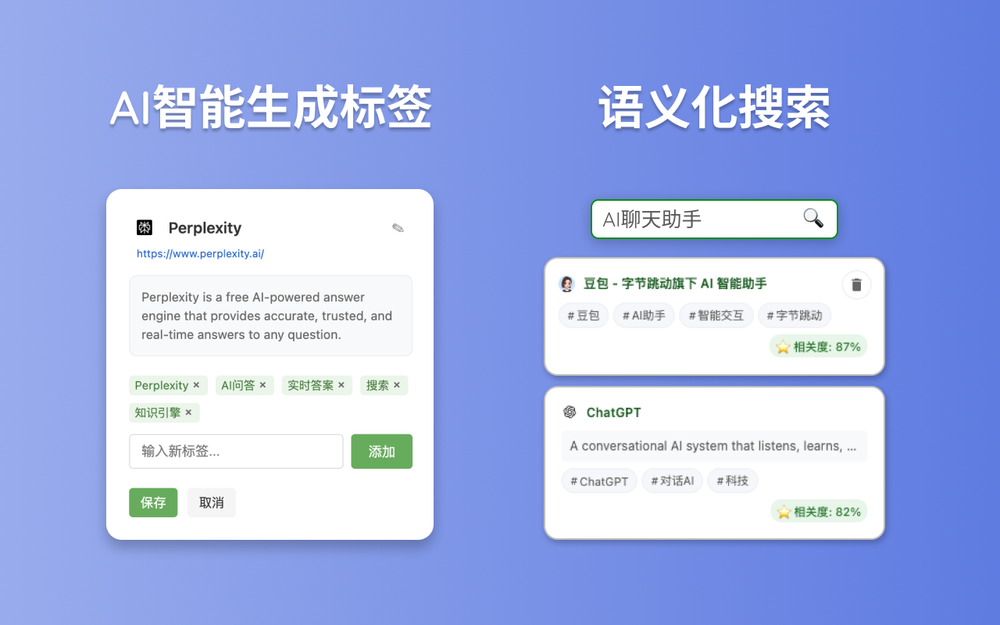
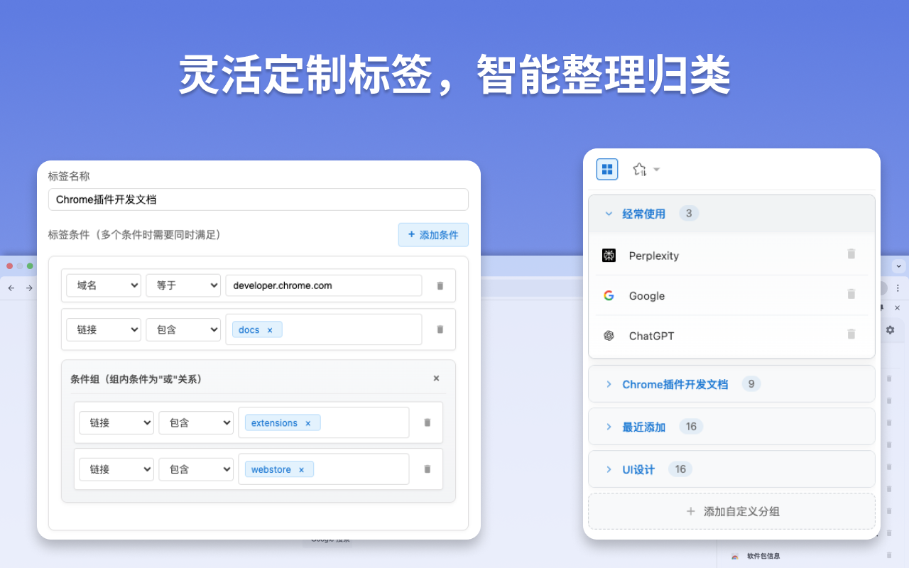

# SmartBookmark
Smart Bookmark 是一款基于 AI 的智能书签管理插件，专注于解决书签收藏和搜索的痛点。插件简洁高效，让书签管理变得更加智能和省心！

### **Chrome 商店链接**  
[🔗 Smart Bookmark - 点击体验](https://chromewebstore.google.com/detail/smart-bookmark/nlboajobccgidfcdoedphgfaklelifoa)  

### **功能亮点**  
- **AI 自动生成标签**：收藏网页时，智能生成相关标签，无需手动归类，彻底告别繁琐的文件夹！  
- **语义化搜索**：记不住关键词也不用担心，用自然语言描述内容即可快速找到目标书签。  
- **自定义筛选规则**：支持按标题、标签、网址等筛选规则，轻松实现书签自动归类，管理更加高效。  

### **插件截图**  
  
  

### **使用成本**  
插件完全免费！用户只需提供自己的模型 API Key（目前支持 OpenAI、通义千问、智谱 GLM）。经过实际测试，**1 元的 Token 足够使用一个多月**，高效又实惠，轻松享受 AI 的强大能力！  

### **开发计划**  
- [ ] 支持更多API，增加自定义API支持
- [ ] 支持导入浏览器书签
- [ ] 支持书签导入导出功能  
- [ ] 支持书签收藏快捷键

### **反馈交流群**  
  
如二维码失效，请添加我的个人微信（zhw-super），并备注 “书签” 加入微信交流群

### **感谢**  
本项目使用Cursor开发，感谢 [Cursor](https://www.cursor.com/) 提供的强大AI能力！

### **License**
本项目基于 [MIT 协议](LICENSE) 开源，请遵守协议内容。
