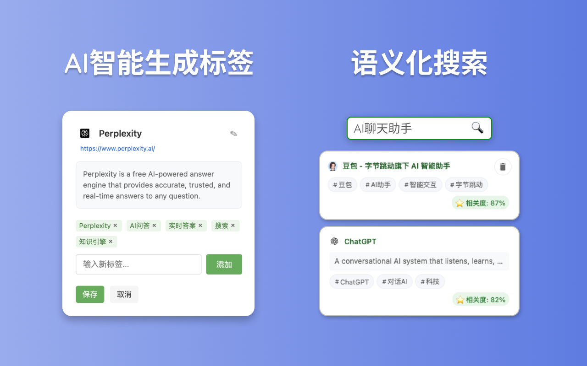
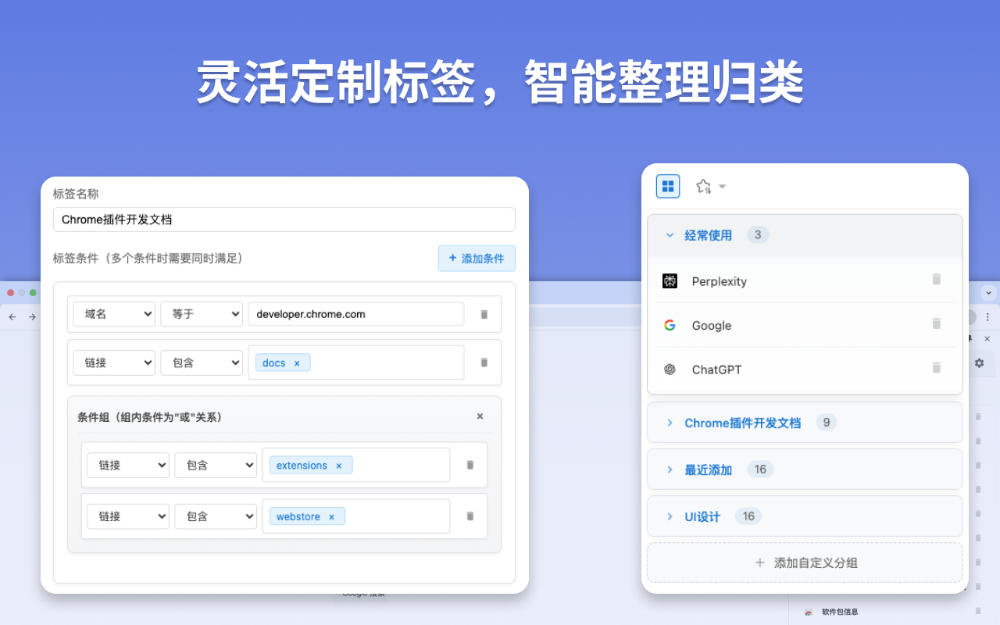
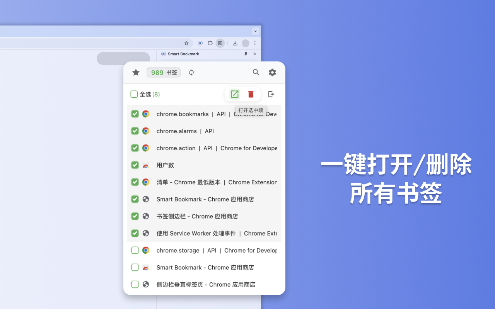

<p align="center" style="display: flex; align-items: center; justify-content: center; gap: 0.5em;">
  
  <strong style="font-size: 2.5em;">Smart Bookmark</strong>
</p>

<p align="center">
  
  
  <a href="https://chromewebstore.google.com/detail/smart-bookmark/nlboajobccgidfcdoedphgfaklelifoa"></a>
  <a href="https://microsoftedge.microsoft.com/addons/detail/smart-bookmark/dohicooegjedllghbfapbmbhjopnkbad"></a>
</p>

<p align="center">
  基于 AI 的智能书签管理 Chrome 扩展，专注于解决书签收藏和搜索的痛点，让管理更智能省心！
</p>

<p align="center">
  <a href="#项目介绍">项目介绍</a>
  ·
  <a href="#快速开始">快速开始</a>
  ·
  <a href="#功能特性">功能特性</a>
  ·
  <a href="#插件截图">插件截图</a>
  ·
  <a href="#开发计划">开发计划</a>
  ·
  <a href="#常见问题">常见问题</a>
</p>

---

## 目录

- [项目介绍](#项目介绍)
- [功能特性](#功能特性)
- [快速开始](#快速开始)
- [插件截图](#插件截图)
- [使用成本](#使用成本)
- [开发计划](#开发计划)
- [常见问题](#常见问题)
- [本地开发](#本地开发)
- [贡献指南](#贡献指南)
- [致谢](#致谢)
- [许可证](#许可证)

---

## 项目介绍

Smart Bookmark 是一款基于 AI 的智能书签管理 Chrome/Edge 扩展。收藏时**自动生成标签**，搜索时**理解自然语言**，支持 WebDAV 同步、自定义筛选、批量操作等。插件免费，配置 API Key 或使用 Ollama 本地模型即可使用。

---

## 功能特性

- **🤖 AI 自动生成标签**：收藏网页时，智能生成相关标签，无需手动归类，彻底告别繁琐的文件夹！
- **🔍 语义化搜索**：记不住关键词也不用担心，用自然语言描述内容即可快速找到目标书签。
- **📋 自定义筛选规则**：支持按标题、标签、网址等筛选规则，轻松实现书签自动归类，管理更加高效。
- **☁️ WebDAV 同步**：支持 WebDAV 同步，轻松实现多设备同步。
- **✅ 批量操作**：支持批量选择和删除书签，管理更加便捷。
- **⌨️ 快捷键支持**：`Ctrl+K` / `Cmd+K` 快速搜索，`Ctrl+B` / `Cmd+B` 快速保存。
- **🌙 深色模式**：支持深色/浅色主题切换。

---

## 快速开始

### 安装方式

| 浏览器 | 安装链接 |
|--------|----------|
| Chrome | [Chrome 应用商店](https://chromewebstore.google.com/detail/smart-bookmark/nlboajobccgidfcdoedphgfaklelifoa) |
| Edge | [Microsoft Edge Addons](https://microsoftedge.microsoft.com/addons/detail/smart-bookmark/dohicooegjedllghbfapbmbhjopnkbad) |

### 基本使用

**1. 初次配置**

- 安装后，右键点击扩展图标 → 选择「打开侧边栏」或「选项」进入设置
- 在 **API 配置** 中选择模型提供商（OpenAI、通义千问、智谱 GLM、Ollama 等），填入 API Key
- 配置完成后，即可使用 AI 相关功能

**2. 收藏书签**

- **快速保存**：点击工具栏图标，弹出保存窗口，可编辑标题和标签后保存当前页面
- **快捷键**：在任意网页按 `Ctrl+B`（Mac：`Cmd+B`）快速打开保存窗口
- 保存时 AI 会自动生成标签，也可手动修改或补充

**3. 搜索书签**

- **侧边栏**：右键扩展图标 →「打开侧边栏」，在搜索框中输入关键词或自然语言描述
- **快捷键**：按 `Ctrl+K`（Mac：`Cmd+K`）唤起快速搜索
- **地址栏**：在地址栏输入 `sb` 加空格，也可快速搜索书签

**4. 其他操作**

- 在侧边栏可浏览、编辑、删除书签，支持批量选择
- 在设置中可配置 WebDAV 同步、筛选规则、主题等

---

## 插件截图

<p align="center">
  
</p>

<p align="center">
  
</p>

<p align="center">
  
</p>

---

## 使用成本

插件**完全免费**！用户只需提供自己的模型 API Key。经过实际测试，**1 元的 Token 足够使用一个多月**，高效又实惠，轻松享受 AI 的强大能力！

---

## 开发计划

### 已完成 ✅

- [x] 支持更多 API，增加自定义 API 支持
- [x] 支持导入浏览器书签
- [x] 支持书签收藏、搜索快捷键
- [x] 增加深色模式
- [x] 支持书签导入导出功能
- [x] 支持 Ollama 本地模型
- [x] 增加 WebDAV 同步功能
- [x] 增加书签批量选择和删除功能
- [x] 支持 AI 生成书签摘要
- [x] 上架 Edge 浏览器商店
- [x] 增加多语言支持

### 计划中 📋

- [ ] 支持智能推荐标签
- [ ] 支持自定义提示词
- [ ] 支持多级标签和 AI 自动分类
- [ ] 支持批量整理历史书签

---

## 常见问题

<details>
<summary><b>为什么需要配置 API Key？</b></summary>

插件的 AI 功能（如自动生成标签、语义化搜索、书签摘要等）均依赖大语言模型。本插件不内置 AI 服务，而是调用 OpenAI、通义千问、智谱 GLM 等第三方接口，因此需要你自行配置 API Key。使用 Ollama 等本地模型时，也需在设置中完成相应的 API 配置。

</details>

<details>
<summary><b>如何接入 Ollama 本地模型？</b></summary>

**第一步：安装 Ollama**

从 [Ollama 官网](https://ollama.com/) 下载并安装。

**第二步：设置跨域并启动**

| 系统 | 操作 |
|------|------|
| macOS | 终端执行 `launchctl setenv OLLAMA_ORIGINS "*"`，再启动 Ollama App |
| Windows | 控制面板 → 系统属性 → 环境变量 → 新建用户变量 `OLLAMA_HOST=0.0.0.0` 和 `OLLAMA_ORIGINS=*`，再启动 App |
| Linux | 终端执行 `OLLAMA_ORIGINS="*" ollama serve` |

**第三步：在插件中配置**

打开插件设置 → API 配置 → 选择「自定义服务」，填写：

| 配置项 | 填写内容 |
|--------|----------|
| API 接口地址 | `http://localhost:11434/v1` |
| API Key | `ollama` |
| 模型 | 选择你本地已安装的模型（如 `llama3`、`qwen2` 等） |

</details>

---

## 本地开发

1. 克隆项目：
   ```bash
   git clone https://github.com/howoii/SmartBookmark.git
   cd SmartBookmark
   ```

2. 在 Chrome 中加载扩展：
   - 打开 `chrome://extensions/`
   - 开启「开发者模式」
   - 点击「加载已解压的扩展程序」，选择项目目录

---

## 贡献指南

欢迎贡献代码、报告问题或提出建议！

- **报告 Bug**：请使用 [Issues](https://github.com/howoii/SmartBookmark/issues) 提交
- **功能建议**：欢迎在 Issues 中讨论
- **提交代码**：Fork 本仓库后提交 Pull Request

---

## 资助开发

如果 Smart Bookmark 对您有帮助，欢迎通过以下方式支持项目持续发展：

[💝 点击前往资助页面](https://howoii.github.io/smartbookmark-support/donate.html)

您的支持将帮助我们持续改进和完善插件功能，感谢您的慷慨支持！

---

## 致谢

本项目使用 [Cursor](https://www.cursor.com/) 开发，感谢其提供的强大 AI 能力！

---

## 许可证

本项目基于 [MIT 协议](LICENSE) 开源，请遵守协议内容。

<p align="center">
  <strong>⭐ 如果觉得有帮助，欢迎给个 Star！</strong>
</p>
